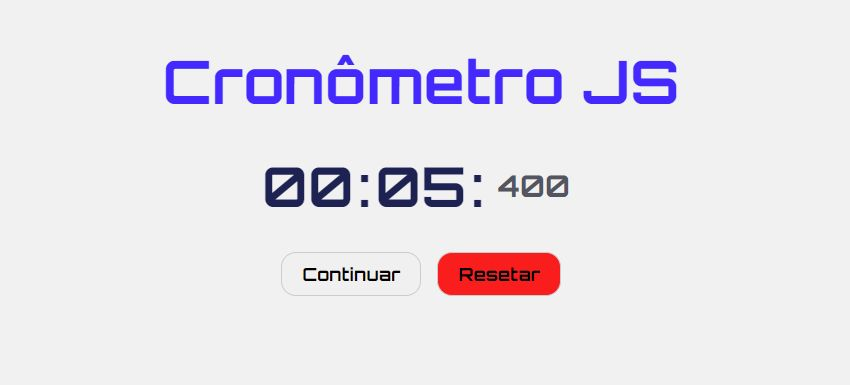

Projeto para treino de HTML, CSS e Javascript

Aprenda a Programar um Cronômetro com JavaScript - Projeto de JavaScript para iniciantes
Matheus Battisti - Hora de Codar
14/02/2023
Vídeo tutorial em https://www.youtube.com/watch?v=SbST27OWpmo

